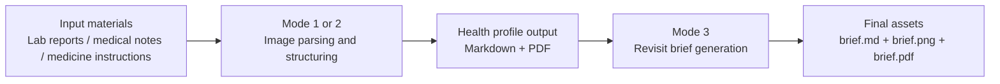

# Aura Health Profile (OpenClaw Skill)

**Turn complicated medical-record management into calm daily support.**  
An intelligent health-assistant skill designed for chronic-disease patients. Powered by Alibaba Cloud Bailian Qwen and Wan models, it converts scattered lab reports, medical notes, and medication instructions into clear health profiles and revisit briefs.

Chinese version: `README_CN.md`

## Background

When chronic-disease management becomes an "invisible workload," dense medical terms and out-of-range markers on lab reports can feel confusing and stressful. Paper records, lab sheets, and medication boxes are hard to organize, and important documents are often difficult to find before follow-up visits or even lost.

## Features

- **Mode 1 (`build`)**: Parse medical images and generate a complete health profile (`.md` / `.pdf`).
- **Mode 2 (`update`)**: Process only new materials and merge them into the existing profile incrementally.
- **Mode 3 (`brief`)**: Generate a revisit brief (`.md` + styled image + `.pdf`) for quick outpatient communication.
- **Structured tracking**: Consolidate trends, exam results, and medications into long-term, searchable records.
- **Multi-model workflow**: Qwen handles clinical understanding and consolidation; Wan generates visual brief assets.

## Workflow Diagram

## Status

- **Shipped:** Mode 1 (build), Mode 2 (update), and Mode 3 (revisit brief).

## Quick Start

For first-time setup, start with `ONBOARD.md` (recommended).

Then see `SKILL.md` (English) or `SKILL_CN.md` (Simplified Chinese) for detailed prerequisites, paths, and mode-specific commands.

## GitHub

- Repository: `TBD` (reserved)
- Issues: `TBD` (reserved)
- Pull Requests: `TBD` (reserved)

## Project Commitment

Always open source and free forever. Aura's mission is to help every chronic-disease patient manage health with less burden. If you have suggestions, questions, or want to contribute code, feel free to open an Issue or Pull Request.

## ClawHub

Publishing is **MIT-0** per [ClawHub policy](https://github.com/openclaw/clawhub/blob/main/docs/skill-format.md). See `PUBLISHING.md` for checklist and CLI notes.

## License

MIT-0 — see `LICENSE`.
