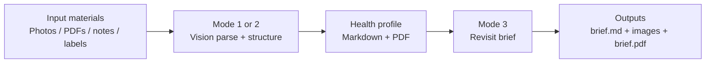

# Aura Health Profile (OpenClaw Skill)

**Turn complicated medical-record management into calm daily support.**  
An OpenClaw skill for chronic-disease care, powered by **Alibaba Cloud Bailian** (Qwen for text/vision understanding, Wan for brief visuals). It turns scattered **photos, scanned PDFs, lab reports, clinical notes, and medication labels** into a single structured health profile and optional **revisit briefs** (Markdown, PDF, and styled images).

Chinese version: `README_CN.md`

## Background

Chronic illness often comes with an “invisible workload”: dense jargon on labs, hard-to-track trends, and files spread across camera rolls, downloads, and paper folders. This skill helps you **capture, normalize, and merge** that material so it is easier to review before appointments and safer to archive over time.

## Features

- **Mode 1 (`build`)**: First-time or full rebuild. Parses **raster images** (JPEG/PNG/WebP) and **PDFs** (each page rasterized, sent through the **vision** model; long PDFs can be summarized into **bundles** before merge). Outputs `health_profile_*.md` and, after a separate step, `.pdf`.
- **Mode 2 (`update`)**: Incremental run—only **new** images or PDF pages (by content hash) are parsed, then merged into the latest profile.
- **Mode 3 (`brief`)**: From the profile, generates a **revisit brief** (`revisit_brief_*.md`), a **doctor-facing** one-page graphic, an optional **patient comic** strip, and a brief PDF (Wan + Qwen pipeline; comic can be skipped to save cost).
- **Two merge strategies**: **Fast merge** (`build_profile.py` / `update_profile.py`) for smaller sets; **time-sharded merge** (`build_profile_sharded.py` / `update_profile_sharded.py`) for **multi-year archives** or **many** image/PDF-derived intermediates—recommended when volume is large.
- **Structured tracking**: Metrics and intermediate Markdown under `~/.aura-health/`, final profile and briefs under `~/Documents/AuraHealth/` (see `SKILL.md` for paths).
- **Markdown → PDF**: Prefer **pdf-generator** skill or **pandoc** when available; otherwise **`md_to_pdf.py`** (including **CJK** layout when fonts are configured).

## Workflow Diagram

## Status

- **Shipped:** Modes 1–3 (build, update, brief), PDF pipeline, fast and sharded builders, bilingual templates and docs.
- **Current release:** **v1.1.0** — see `CHANGELOG.md` / `CHANGELOG_CN.md`.

## Quick Start

First-time setup: **`ONBOARD.md`** (Simplified Chinese: **`ONBOARD_CN.md`**).

Commands, environment variables, and paths: **`SKILL.md`** (English) or **`SKILL_CN.md`** (Simplified Chinese).

## GitHub

- Repository: https://github.com/Cartmanfku/aura_health_profile

## Skill listings

- **DeskClaw:** [skills.deskclaw.me/skills/aura-health-profile](https://skills.deskclaw.me/skills/aura-health-profile)  
- **ModelScope:** [modelscope.cn/skills/cartman/aura_health_profile](https://modelscope.cn/skills/cartman/aura_health_profile)  

## Author & contact

- **Handle:** momo哈吉米  
- **Email:** [cartman.djw@gmail.com](mailto:cartman.djw@gmail.com)  

## Project Commitment

Always open source and free forever. Aura's mission is to help every chronic-disease patient manage health with less burden. If you have suggestions, questions, or want to contribute code, feel free to open an Issue or Pull Request.

## ClawHub

Publishing is **MIT-0** per [ClawHub policy](https://github.com/openclaw/clawhub/blob/main/docs/skill-format.md). Maintainer checklist and CLI: `PUBLISHING.md` (Simplified Chinese: `PUBLISHING_CN.md`). Release notes: `CHANGELOG.md` / `CHANGELOG_CN.md`.

## License

MIT-0 — see `LICENSE`.
