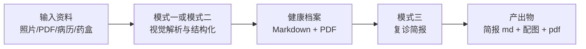

# Aura Health Profile（OpenClaw 技能）

**将繁琐的病历管理，变为安心的日常陪伴。**  
面向慢性病护理的 OpenClaw 技能，基于**阿里云百炼**：**Qwen** 负责图文理解与档案合并，**Wan** 负责复诊简报配图。把相册里的化验单照片、**扫描版 PDF**、病历与药盒说明等零散资料，整理成一份可长期维护的**健康档案**，并可选生成**复诊简报**（Markdown、PDF 与一页式配图）。

英文版请见：`README.md`

## 背景

慢性病管理常常像一份「隐形工作」：化验单术语难懂、趋势难对比，资料又散落在手机相册、下载文件夹和纸质单据里。本技能帮助把材料**结构化、可追溯地归档**，复诊前查阅更省心，长期留存也更清晰。

## 功能一览

- **模式一（`build`）**：首次或全量重建。支持**栅格图**（JPEG/PNG/WebP）与 **PDF**（每页转图后经**视觉模型**解析；长报告可先打成 **bundle** 再参与合并），输出 `health_profile_*.md`，PDF 需按文档单独导出。
- **模式二（`update`）**：**增量**解析：仅处理 `processed.json` 中尚未记录的新图或新 PDF 页，再与既有档案合并。
- **模式三（`brief`）**：基于档案生成**复诊简报**（`revisit_brief_*.md`）、**医生向**一页图、可选的**患者向**漫画格图及简报 PDF（可跳过第二次出图以节省费用）。
- **两种合并方式**：资料量一般时用**快速合并**（`build_profile.py` / `update_profile.py`）；**多年累积**或图片、PDF **很多**时，推荐使用**分期汇总**（`build_profile_sharded.py` / `update_profile_sharded.py`）。
- **结构化沉淀**：中间稿与指标在 `~/.aura-health/`，成品档案与简报在 `~/Documents/AuraHealth/`（路径与命令见 `SKILL_CN.md`）。
- **Markdown → PDF**：优先 **pdf-generator** 技能或 **pandoc**；否则使用 **`md_to_pdf.py`**（支持配置**中文字体**等 CJK 排版）。

## 工作流程图示

## 当前状态

- **已发布：** 模式一至三（build / update / brief）、PDF 全流程、快速合并与分期汇总、中英模板与文档。
- **当前版本：** **v1.1.0** — 详见 `CHANGELOG_CN.md` / `CHANGELOG.md`。

## 快速开始

首次安装与自检请阅读 **`ONBOARD_CN.md`**（英文：**`ONBOARD.md`**）。

环境变量、路径与各模式命令见 **`SKILL_CN.md`**（英文：**`SKILL.md`**）。

## GitHub

- 仓库地址：https://github.com/Cartmanfku/aura_health_profile

## 技能地址

- **DeskClaw：** [skills.deskclaw.me/skills/aura-health-profile](https://skills.deskclaw.me/skills/aura-health-profile)  
- **ModelScope：** [modelscope.cn/skills/cartman/aura_health_profile](https://modelscope.cn/skills/cartman/aura_health_profile)  

## 作者与联系

- **称呼：** momo哈吉米  
- **邮箱：** [cartman.djw@gmail.com](mailto:cartman.djw@gmail.com)  

## 项目承诺

永久开源免费，Aura 的使命是让每一位慢性病患者都能更轻松地管理健康。如果你有任何建议、问题或希望贡献代码，欢迎提交 Issue 或 Pull Request。

## ClawHub

发布协议遵循 **MIT-0**（符合 [ClawHub policy](https://github.com/openclaw/clawhub/blob/main/docs/skill-format.md)）。发布前检查项与 CLI 说明见 `PUBLISHING_CN.md`（英文：`PUBLISHING.md`）；版本变更见 `CHANGELOG_CN.md`（英文：`CHANGELOG.md`）。

## License

MIT-0 — 见 `LICENSE`。
