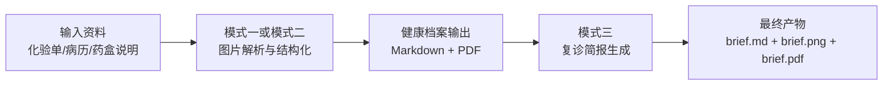

# Aura Health Profile（OpenClaw 技能）

**将繁琐的病历管理，变为安心的日常陪伴。**  
一款专为慢性病患者设计的智能健康助手技能，基于阿里云百炼 Qwen 与 Wan 模型，帮你把散乱的化验单、病历、药盒说明变成清晰易懂的健康档案与复诊简报。

英文版请见：`README.md`

## 背景

当慢性病管理成为一份“隐形工作”，化验单上密密麻麻的专业术语和上下箭头让人困惑紧张，散乱的纸质病历、化验单、药盒难以整理，复诊时常常翻箱倒柜找不到需要的文件，甚至不慎丢失。

## 功能一览

- **模式一（`build`）**：解析医学图片，构建完整健康档案（`.md` / `.pdf`）。
- **模式二（`update`）**：增量处理新资料，在原有档案基础上自动合并更新。
- **模式三（`brief`）**：生成复诊简报（`.md` + 样式化图片 + `.pdf`），便于门诊快速沟通。
- **结构化沉淀**：将化验趋势、检查结果、用药信息统一整理为长期可追踪记录。
- **多模型协同**：Qwen 负责理解与整合医疗内容，Wan 负责可视化简报生成。

## 工作流程图示

## Status

- **Shipped:** Mode 1 (build), Mode 2 (update), and Mode 3 (revisit brief).

## 快速开始

首次使用建议先阅读 `ONBOARD.md`。

详细前置条件、路径约定和各模式命令，请查看 `SKILL.md`（英文）或 `SKILL_CN.md`（简体中文）。

## GitHub

- 仓库地址：`TBD`（预留）
- Issues：`TBD`（预留）
- Pull Requests：`TBD`（预留）

## 项目承诺

永久开源免费，Aura 的使命是让每一位慢性病患者都能更轻松地管理健康。如果你有任何建议、问题或希望贡献代码，欢迎提交 Issue 或 Pull Request。

## ClawHub

发布协议遵循 **MIT-0**（符合 [ClawHub policy](https://github.com/openclaw/clawhub/blob/main/docs/skill-format.md)）。发布前检查项和 CLI 说明见 `PUBLISHING.md`。

## License

MIT-0 — 见 `LICENSE`。
